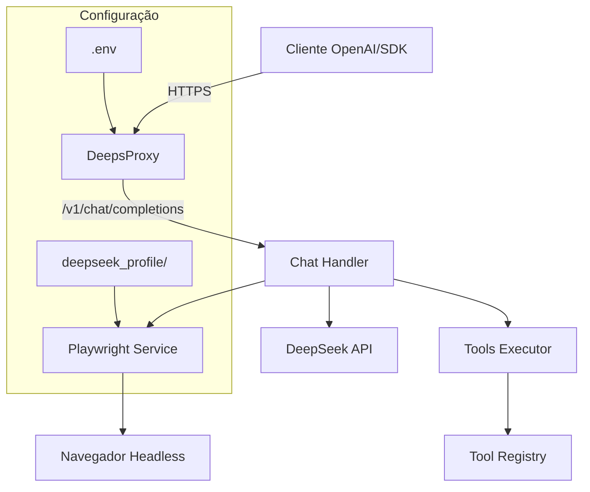

# DeepsProxy

Proxy API local compatível com OpenAI que roteia requisições para modelos DeepSeek, com integração de automação de navegador via Playwright para execução de ferramentas e interações web.


[](https://www.typescriptlang.org/)
[](https://hono.dev/)
[](https://playwright.dev/)
[](LICENSE)

---

## ✨ Features

- **OpenAI API Compatible**: Interface compatível com `/v1/chat/completions` e `/v1/models`
- **Tool Execution**: Sistema de ferramentas executáveis via Playwright
- **Session Persistence**: Login persistente com armazenamento de perfil do navegador
- **Authentication**: Suporte opcional a API Key via header `Authorization` ou `X-API-Key`
- **Type-Safe**: Código 100% TypeScript com strict mode
- **Docker Ready**: Deploy simplificado com Docker Compose

---

## 🏗️ Arquitetura



---

## 📋 Pré-requisitos

| Dependência | Versão Mínima | Instalação |
|------------|--------------|-----------|
| Node.js | v20.x | [nvm](https://github.com/nvm-sh/nvm) |
| npm | v9.x | Incluído com Node.js |
| Playwright | - | `npx playwright install` |
| Docker (opcional) | v24.x | [Docker Docs](https://docs.docker.com/get-docker/) |

---

## 🚀 Instalação

### Via npm

```bash
# Clonar repositório
git clone https://github.com/pedrofariasx/deepsproxy.git
cd deepsproxy

# Instalar dependências
npm install

# Instalar browsers do Playwright
npx playwright install
```

### Via Docker

```bash
# Build da imagem
docker-compose build

# Iniciar containers
docker-compose up -d
```

---

## ⚙️ Configuração

Crie o arquivo `.env` na raiz do projeto:

```env
# Porta do servidor (default: 3000)
PORT=3000

# Chave de API para proteger endpoints (opcional)
API_KEY=sua-chave-secreta-aqui

# Configurações Playwright
PLAYWRIGHT_HEADLESS=true
PLAYWRIGHT_TIMEOUT=30000

# Logging
LOG_LEVEL=info
```

### Variáveis de Ambiente

| Variável | Descrição | Default | Obrigatória |
|----------|-----------|---------|------------|
| `PORT` | Porta HTTP do servidor | `3000` | Não |
| `API_KEY` | Chave para autenticação de requests | - | Não |
| `PLAYWRIGHT_HEADLESS` | Executar browser em modo headless | `true` | Não |
| `PLAYWRIGHT_TIMEOUT` | Timeout para operações do Playwright (ms) | `30000` | Não |

\* Necessária para funcionalidades que requerem acesso à API DeepSeek

---

## 🔐 Autenticação

Se `API_KEY` estiver configurada, todas as requisições devem incluir uma das opções:

```bash
# Via Bearer Token
curl -H "Authorization: Bearer sua-chave" http://localhost:3000/v1/chat/completions

# Via X-API-Key header
curl -H "X-API-Key: sua-chave" http://localhost:3000/v1/chat/completions
```

Resposta para autenticação falha:
```json
{ "error": "Unauthorized" }
```
Status: `401`

---

## 📡 API Reference

### Health Check

```http
GET /health
```

**Response** `200 OK`:
```json
{ "status": "ok" }
```

---

### List Models

```http
GET /v1/models
```

**Response** `200 OK`:
```json
{
  "object": "list",
  "data": [
    {
      "id": "deepseek-v4-flash",
      "object": "model",
      "created": 1715616000,
      "owned_by": "deepseek"
    },
    {
      "id": "deepseek-v4-flash-thinking",
      "object": "model",
      "created": 1715616000,
      "owned_by": "deepseek"
    },
    {
      "id": "deepseek-v4-pro",
      "object": "model",
      "created": 1715616000,
      "owned_by": "deepseek"
    },
    {
      "id": "deepseek-v4-pro-thinking",
      "object": "model",
      "created": 1715616000,
      "owned_by": "deepseek"
    }
  ]
}
```

---

### Chat Completions

```http
POST /v1/chat/completions
Content-Type: application/json
```

**Request Body**:
```json
{
  "model": "deepseek-flash-thinking",
  "messages": [
    { "role": "user", "content": "Qual é a previsão do tempo?" }
  ],
  "tools": [
    {
      "type": "function",
      "function": {
        "name": "get_weather",
        "description": "Obter previsão do tempo",
        "parameters": {
          "type": "object",
          "properties": {
            "location": { "type": "string" }
          },
          "required": ["location"]
        }
      }
    }
  ],
  "tool_choice": "auto",
  "stream": false
}
```

**Response** `200 OK`:
```json
{
  "id": "chatcmpl-xxx",
  "object": "chat.completion",
  "created": 1715616000,
  "model": "deepseek-flash-thinking",
  "choices": [
    {
      "index": 0,
      "message": {
        "role": "assistant",
        "content": "A previsão para São Paulo é de 24°C com sol.",
        "tool_calls": []
      },
      "finish_reason": "stop"
    }
  ],
  "usage": {
    "prompt_tokens": 45,
    "completion_tokens": 23,
    "total_tokens": 68
  }
}
```

---

## 💻 Exemplos de Uso

### cURL

```bash
curl http://localhost:3000/v1/chat/completions \
  -H "Content-Type: application/json" \
  -d '{
    "model": "deepseek-flash-thinking",
    "messages": [{"role": "user", "content": "Olá!"}]
  }'
```

### OpenAI SDK (Node.js)

```typescript
import OpenAI from 'openai';

const openai = new OpenAI({
  baseURL: 'http://localhost:3000/v1',
  apiKey: process.env.API_KEY || 'sk-no-key-required'
});

const completion = await openai.chat.completions.create({
  model: 'deepseek-thinking',
  messages: [{ role: 'user', content: 'Explique TypeScript' }]
});

console.log(completion.choices[0].message.content);
```

### Python (openai library)

```python
from openai import OpenAI

client = OpenAI(
    base_url="http://localhost:3000/v1",
    api_key="sk-no-key-required"
)

response = client.chat.completions.create(
    model="deepseek-thinking",
    messages=[{"role": "user", "content": "Hello!"}]
)

print(response.choices[0].message.content)
```

---

## 🔧 Comandos Disponíveis

| Comando | Descrição |
|---------|-----------|
| `npm start` | Inicia o servidor em produção |
| `npm run dev` | Inicia com hot-reload para desenvolvimento |
| `npm run login` | Executa fluxo de login e salva sessão do navegador |
| `npm test` | Executa suite de testes |
| `npm run build` | Compila TypeScript para `dist/` |
| `npx playwright install` | Instala browsers para automação |

---

## 📁 Estrutura do Projeto

```
deepsproxy/
├── src/
│   ├── index.ts              # Entry point: servidor Hono + middleware
│   ├── routes/
│   │   └── chat.ts          # Handler POST /v1/chat/completions
│   ├── services/
│   │   ├── deepseek.ts      # Cliente API DeepSeek
│   │   └── playwright.ts    # Gerenciamento de browser/session
│   ├── tools/
│   │   ├── executor.ts      # Execução dinâmica de ferramentas
│   │   ├── registry.ts      # Registro e descoberta de tools
│   │   ├── schema.ts        # Validação de schemas JSON
│   │   └── types.ts         # Tipos do sistema de tools
│   ├── runtime/
│   │   ├── engine.ts        # Motor principal de execução
│   │   └── types.ts         # Tipos do runtime
│   ├── types/
│   │   └── openai.ts        # Tipos compatíveis com OpenAI API
│   ├── utils/
│   │   └── types.ts         # Utilitários de tipo
│   ├── login.ts             # Script de autenticação inicial
│   ├── index.test.ts        # Testes unitários básicos
│   └── advanced.test.ts     # Testes de integração avançados
├── docker-compose.yml        # Orquestração multi-container
├── Dockerfile                # Imagem Docker otimizada
├── tsconfig.json            # Configuração TypeScript strict
├── package.json             # Dependências e scripts
├── .env.example             # Template de variáveis de ambiente
└── deepseek_profile/        # Armazenamento de sessão (gitignored)
```

---

## 🐳 Docker

### docker-compose.yml

```yaml
services:
  deepsproxy:
    build: .
    ports:
      - "3000:3000"
    environment:
      - PORT=3000
      - PLAYWRIGHT_HEADLESS=true
    volumes:
      - ./deepseek_profile:/app/deepseek_profile
    restart: unless-stopped
```

### Build e Execução

```bash
# Build
docker-compose build

# Executar em background
docker-compose up -d

# Ver logs
docker-compose logs -f

# Parar
docker-compose down
```

---

## 🧪 Testes

```bash
# Executar todos os testes
npm test

# Executar com watch mode
npm run test:watch

# Executar testes específicos
npm test -- src/index.test.ts

# Coverage report
npm run test:coverage
```

---

## 🔍 Troubleshooting

### Playwright não inicializa

```bash
# Reinstalar browsers
npx playwright install --with-deps

# Verificar dependências do sistema
npx playwright install-deps
```

### Erro de autenticação

- Verifique se `API_KEY` no `.env` corresponde ao header enviado
- Teste sem `API_KEY` configurada para isolar o problema

### Timeout em requests

- Aumente `PLAYWRIGHT_TIMEOUT` no `.env`
- Verifique conectividade com a API DeepSeek
- Considere executar com `PLAYWRIGHT_HEADLESS=false` para debug visual

### Sessão não persiste

- Certifique-se que `deepseek_profile/` tem permissões de escrita
- Execute `npm run login` para renovar a sessão

---

## 🤝 Contribuindo

1. Fork o repositório
2. Crie uma branch para sua feature: `git checkout -b feature/minha-feature`
3. Commit suas mudanças: `git commit -m 'feat: adiciona minha feature'`
4. Push para a branch: `git push origin feature/minha-feature`
5. Abra um Pull Request

### Guidelines de Código

- Siga o padrão TypeScript strict
- Adicione testes para novas funcionalidades
- Mantenha compatibilidade com OpenAI API spec

---

## 📄 License

Distribuído sob licença ISC. Veja `LICENSE` para mais informações.

---

## ⚠️ Disclaimer

> Este projeto é fornecido estritamente para fins educacionais e de pesquisa.

Os autores não incentivam ou endossam:
- Uso indevido ou malicioso
- Automação não autorizada de serviços terceiros
- Violação de Termos de Serviço de plataformas
- Atividades que violem leis ou regulamentações aplicáveis

Usuários são integralmente responsáveis pelo uso deste software, incluindo conformidade com leis, regulamentos e contratos de serviço aplicáveis.

Este repositório demonstra conceitos relacionados a:
- Automação de navegadores com Playwright
- Gerenciamento de sessões e autenticação
- Arquiteturas de runtime compatíveis com OpenAI
- Padrões de proxy e roteamento de API

**Use por sua conta e risco.**
